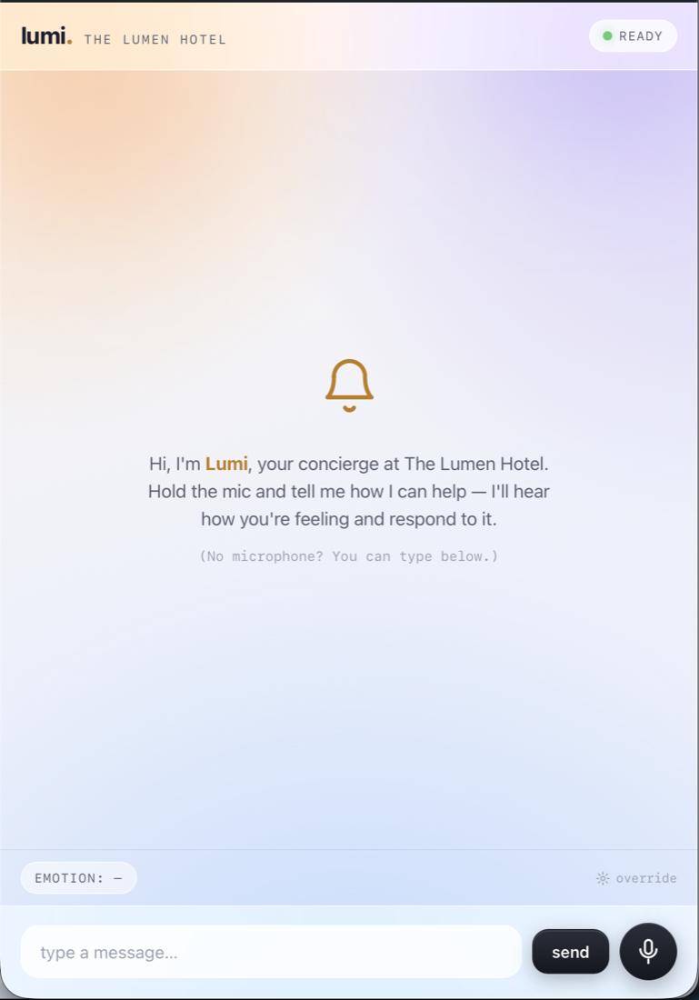
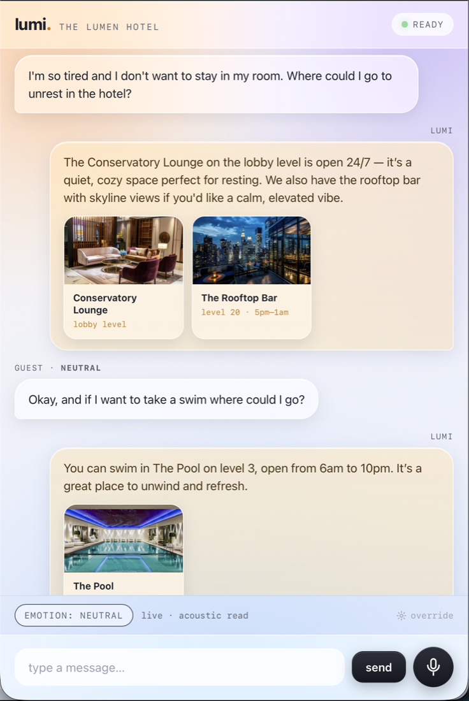
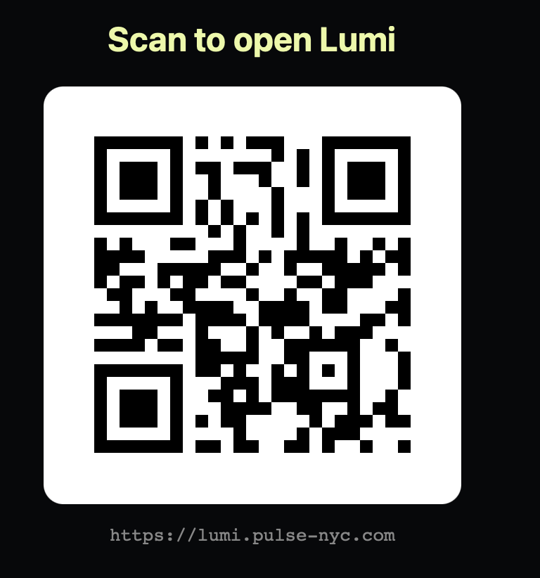

# Lumi — an emotionally intelligent voice concierge

*Built at the AI Tinkerers "Emotionally Intelligent AI Hackathon" (ElevenLabs + Tavus), NYC.*

> **Lumi** is the voice concierge for a luxury hotel, **The Lumen Hotel**. Most voice agents read your **words**. Lumi reads your **tone** — say the same thing calm vs. frustrated and it answers differently: different pacing, word choice, escalation, what it shows on screen, and an expressive voice that matches the moment.

<p align="center">
  
  &nbsp;&nbsp;
  
  &nbsp;&nbsp;
  
</p>

<p align="center"><sub>Left → right: the concierge UI · emotion-gated media in a real chat · scan to open the live PWA</sub></p>

## The problem
Voice is eating the interface, but most agents "sound like they're reading a script in a sensory-deprivation chamber." Generation quality is solved; **emotional intelligence isn't.** An agent that can't hear frustration, match urgency, or shift tone when someone's upset isn't an agent — it's fancy hold music. Lumi treats **emotional voice as a first-class signal.**

## Why a hotel
Hospitality is dense with moments where the *same request* carries very different emotion — exactly where an emotion layer earns its keep:
- a hungry guest deciding on breakfast → upbeat suggestions + appetizing photos;
- a guest whose AirPods were taken from the lounge, swinging **anxious → angry → relieved**;
- a guest who feels unsafe → the **safety guardrail**.

## What it does
- **Hears emotion from the voice itself** — an acoustic model (emotion2vec+) + prosody features (pitch/energy/rate) + a lexical read, fused into one emotional state (with valence–arousal–dominance), tracked across the conversation as a **trajectory**.
- **Responds differently because of it** — the detected emotion conditions the reply's tone/pacing/word-choice, the **expressive voice it's spoken in** (ElevenLabs, voice settings chosen per emotion, spoken inline), and **emotion-gated media** (food/venue tiles, shown only when they help).
- **Distinguishes anger from distress** — service-anger (e.g., the AirPods escalation) is met with **de-escalation + service recovery**, not the crisis path.
- **Guardrail** — genuine distress/escalation routes in-domain to **hotel security / front desk / human** + emergency services, with a clear "not a substitute for emergency services" disclaimer.
- **Evaluation** — a scorecard showing the system tracks *tone, not words*: the same sentence across emotions, where a text-only classifier flatlines and the acoustic model tracks the true emotion.

## How it works
```
mic → STT → emotion fusion (acoustic + prosody + lexical) → tone-adapted reply (LLM, multi-turn) → expressive TTS (spoken inline) + emotion-gated media → playback
```
- **Self-hosted brain & ears:** Ollama (qwen3) + emotion2vec+/openSMILE on local GPUs → ~$0 per interaction.
- **Expressive voice:** ElevenLabs (Flash v2.5; `stability` lowered for more emotional range), spoken inline per reply.
- **Reliable by design:** turn-based core (with optional hands-free "call mode"), and a fallback ladder (model → DSP heuristic → manual toggle → local TTS → backup video).

## Mockups
Static, self-contained UI mockups live in [`docs/mockups/`](docs/mockups/) — open [`index.html`](docs/mockups/index.html). The centerpiece is [`live.html`](docs/mockups/live.html): one screen, three scenarios (lost AirPods / breakfast / safety), with the emotion read, inline spoken replies, emotion-gated media, and the Red-mode guardrail.

## Demo
📹 *Video:* `TODO: youtube link`

## Run it yourself
> The hosted demo uses our GPU server for the heavy models. The repo runs standalone with your own Ollama + ElevenLabs key, or in **local-fallback mode** (deterministic prosody heuristic) with no GPU.

```bash
cp .env.example .env      # add your ElevenLabs key (+ Ollama if you have it)
# server/ : the emotion + LLM inference API   (see server/README)
# app/    : the Mac/web app that you interact with (see app/README)
```

## Built with
ElevenLabs (expressive TTS) · self-hosted Ollama qwen3 + emotion2vec+/openSMILE · FastAPI · *(stretch: Tavus avatar, Redis cache, SearXNG image search).*

## Team
`TODO`

## License
`TODO` (e.g. MIT)
